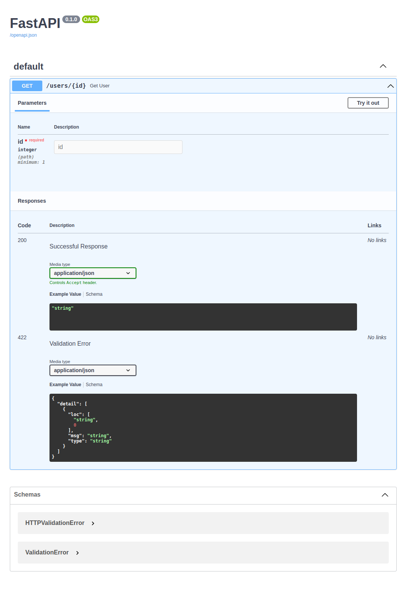

# TIL

## additional
- FastAPI
    - `Starlette` (low-level ASGI web framework)과 `pydantic`(data validation library)으로 구현된 프레임워크
- Uvicorn
    - libuv를 기반으로 하여 cython으로 구현된 `uvloop`와 http parser `httptools`를 사용하는 ASGI web server

### python 비동기
- 주피터노트북으로 공부 후 정리

### reference
- [Uvicorn 소개](https://chacha95.github.io/2021-01-16-python6/)
- [uvicon, fastapi 비동기 메커니즘 이해](https://m.blog.naver.com/pjt3591oo/222772705407)

# chaper 03

## Handling request parameters

### endpoint
- 간단하게 구현 가능 [`.py`](./chap03/01_first_endpoint.py)
- uvicorn으로 로컬서버을 띄운다.
    - `uvicorn 01_first_endpoint:app`명령어를 이용
- `localhost:8000:docs`를 가면 아래와 같은 화면을 볼 수 있고 api를 웹으로 다룰 수 있다. (FastAPI에서 제공)

이미지

### path parameter
- path parameter를 type hint를 이용하여 자료형 제약을 줄 수 있다.
    - 자료형 [`.py`](./chap03/02_path_parameters_base.py)
    - `enum`과 클래스를 이용한 제약 [`.py`](./chap03/03_path_parameters_enum.py)
- parameter 값 자체에 대한 제약을 줄 수도 있다.
    - FastAPI에서 제공하는 `Path` [`.py`](./chap03/04_path_parameters_Path.py)

### query parameter
- `http "http://localhost:8000/users?page=5&size=5` 명령어로 보낼 때 `?` 뒤에 나오는 것들이 query parameter
- query paramter도 마찬가지로 제약을 줄 수 있다.
    - 자료형 [`.py`](./chap03/05_query_parameters.py)
    - FastAPI에서 제공하는 `Query` [`.py`](./chap03/06_query_parameters_Query.py)

### request body
- `http -v POST http://localhost:8000/users name=minsoo age=29` 명령어를 통해서 body에 정보를 넣어서 전달할 수 있다.
    - [GET과 POST의 차이](https://brilliantdevelop.tistory.com/33)
    - `POST`는 body에 정보를 넣는다.
- request body의 값도 제약을 줄 수 있다.
    - 자료형 [`.py`](./chap03/07_request_body.py)
    - pydantic의 `BaseModel` 상속 [`.py`](/chap03/08_request_body_pydantic.py)

### Form data and File upload
- form data, file도 POST 할 수 있다. 이에 대한 제약도 가능하다.
- FastAPI에서 `UploadFile` 클래스를 통해서 특정 값 이상의 memory를 먹으면 disk에 파일을 저장한다. [`.py`](./chap03/09_upload_file.py)

### headers and cookies
- `Header`함수를 이용해서 header를 받도록 제약 [`.py`](./chap03/10_headers.py)
    - `http GET http://localhost:8000 'Hello: World'`, header에서는 key값을 소문자로 인식
- `Cookie` [`.py`](./chap03/11_cookies.py)

### request object
- request object에 접근해야 할 때도 있다. `Request` 클래스를 이용한다. [`.py`](./chap03/12_request_obj.py)