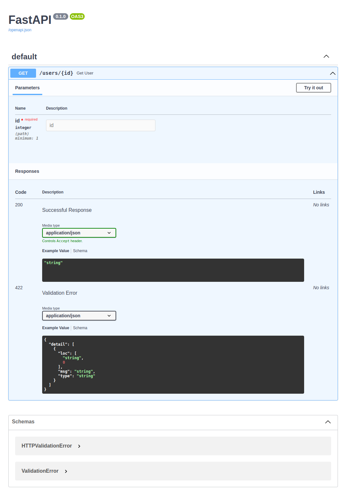

# chapter 03

## 1. Handling request parameters

### endpoint
- 간단하게 구현 가능 [`.py`](./01_first_endpoint.py)
- uvicorn으로 로컬서버을 띄운다.
    - `uvicorn 01_first_endpoint:app`명령어를 이용
- `localhost:8000:docs`를 가면 아래와 같은 화면을 볼 수 있고 api를 웹으로 다룰 수 있다. (FastAPI에서 제공)

이미지

### path parameter
- path parameter를 type hint를 이용하여 자료형 제약을 줄 수 있다.
    - 자료형 [`.py`](./02_path_parameters_base.py)
    - `enum`과 클래스를 이용한 제약 [`.py`](./03_path_parameters_enum.py)
- parameter 값 자체에 대한 제약을 줄 수도 있다.
    - FastAPI에서 제공하는 `Path` [`.py`](./04_path_parameters_Path.py)

### query parameter
- `http "http://localhost:8000/users?page=5&size=5` 명령어로 보낼 때 `?` 뒤에 나오는 것들이 query parameter
- query paramter도 마찬가지로 제약을 줄 수 있다.
    - 자료형 [`.py`](./05_query_parameters.py)
    - FastAPI에서 제공하는 `Query` [`.py`](./06_query_parameters_Query.py)

### request body
- `http -v POST http://localhost:8000/users name=minsoo age=29` 명령어를 통해서 body에 정보를 넣어서 전달할 수 있다.
    - [GET과 POST의 차이](https://brilliantdevelop.tistory.com/33)
    - `POST`는 body에 정보를 넣는다.
- request body의 값도 제약을 줄 수 있다.
    - 자료형 [`.py`](./07_request_body.py)
    - pydantic의 `BaseModel` 상속 [`.py`](./08_request_body_pydantic.py)

### Form data and File upload
- form data, file도 POST 할 수 있다. 이에 대한 제약도 가능하다.
- FastAPI에서 `UploadFile` 클래스를 통해서 특정 값 이상의 memory를 먹으면 disk에 파일을 저장한다. [`.py`](./09_upload_file.py)

### headers and cookies
- `Header`함수를 이용해서 header를 받도록 제약 [`.py`](./10_headers.py)
    - `http GET http://localhost:8000 'Hello: World'`, header에서는 key값을 소문자로 인식
- `Cookie` [`.py`](./11_cookies.py)

### request object
- request object에 접근해야 할 때도 있다. `Request` 클래스를 이용한다. [`.py`](./12_request_obj.py)

## 2. Customizing the response

### path operation parameters
- HTTP reponse에서 커스터마이징 할 수 있는 것중 하나가 `status_code` parameter
    - POST 예시 [`.py`](./13_response_path_parameters_POST.py)
    - delete 예시 [`.py`](./14_response_path_parameters_delete.py)
- `response_model` parameter를 통해서 제약을 줄 수도 있다. [`.py`](./15_reponse_parameters_reponse_model.py)

### reponse parameter
- setting header [`.py`](./16_response_parameter_header.py)
    - key, value 형태로 커스텀
- setting cookies [`.py`](./17_response_parameter_cookie.py)

### setting the status code dynamically
- status code를 dynamic하게 할 수 있다. [`.py`](./18_response_parameter_status_code.py)

## 3. Raising HTTP errors
- FastAPI에서 `HTTPException`를 통해 error를 custom raise 할 수 있다. [`.py`](./19_raise_error.py)

## 4. Building a custom response

### using the `response_class` parameter
- `Response`의 subclass들을 사용 [`.py`](./20_custom_reponse.py)

### custom reponse
- FastAPI가 제공하는 적절한 subclass가 없으면 직접 커스텀 할 수도 있다. [`.py`](./21_custom_reponse.py)