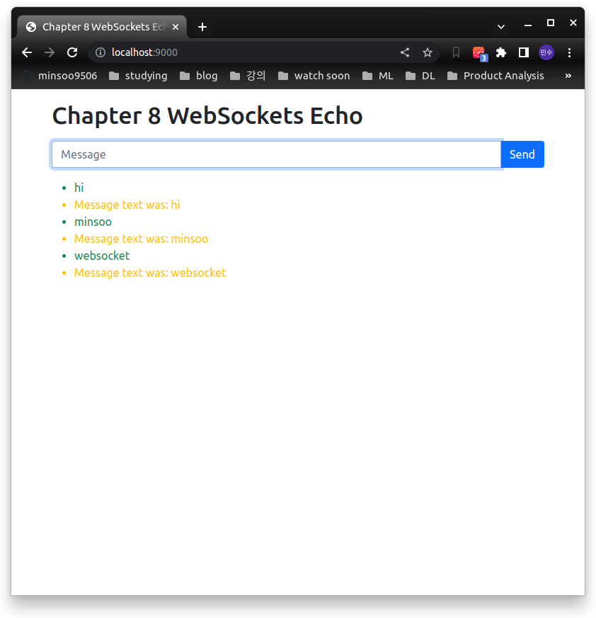

# Chapter 08

## 1. Understanding the principles of two-way communication with WebSockets
- HTTP: request-response principle
- Websocket: 양방향 소통이 가능하다. request를 기다릴 필요가 없도록 해주는 프로토콜

## 2. Creating a WebSocket with FastAPI
- 간단한 WebSocket 구현 [`.py`](./01_echo/)
    - `python -m http.server --directory chap08/01_echo 9000`
- 결과

## 3. Handing multiple WebSocket connections and broadcasting messages
- 여러 명의 유저가 동시에 채팅을 할 수 있는 예시 [`.py`]
